# Terminal Application


## <b><u>Code Styling</b></u>

### <ul><u>Identify any code style guide or styling conventions that the application will adhere to</ul></u>

The style guide that was followed through the creation of the application was PEP8. Multiple styling conventions where used to ensure that the code was easy to understand and read for all users. These style conventions with the PEP8 style guide include:

<br>
<br>

<u>DOCSTRINGS AND COMMENTS</u>

- Docstrings have been used through-out the whole application in order to explain and break down what the functions of the applications do. It also assists users of what the functions are needed for, in order for the application to run smoothly. 
- Comments are used to aid in describing the functions and what they do. Further aiding the user of the applications functionality

<br>

<u>CODE LAY-OUT</u>

- Many code-styling elements have been implemented in the lay-out to ensure readability and understanding. These include blank lines, space indentation, imports and wrapped lines. These are the ones that are used the most in the code lay-out.
- Indentation of four spaces is used to help readability.
- Imports are located at the top of the files and separated. This means they are easily seen and helps organise the file.
- Lines are wrapped if they are over 79 characters to help improve with readability and organisation.
- Blank lines are used to help create separation between different functions which aid in organisation and readability of the file.

<br>

<u>WHITESPACE</u>

- Whitespace is avoided through-out to improve readability and prevent errors.

<br>

<u>NAMING CONVENTIONS</u>
- Naming conventions are followed to ensure that the code is understandable and readable. Making sure that function and variable names are in lower case and separated by underscores if need be.

<br>
<br>
<br>

## <u><b>Develop a list of features that will be included in the application. It must include:
- at least THREE features
- describe each feature</b></u>

NOTE: The comments and docstring will be deleted from the code snippits

<br>

### <u><b>CONTACT MENU</u></b>

The contact menu is created in an easy way for the user to input a number from 1 to 5 for whatever task they wish to do in the contact book. 

The user is prompted to enter a number from the number options. The return statement will return the user's input choice, which is then stored in the user choice variable. This local varible is only assigned in the while loop, and is used to determine whether the application will continue to loop or exit, depending on the user input. It will determine which function the application will execute based on the user's input number choice. This will bring the user to thier choosen function which will then play out.

The while loop will continue to bring the user back to the contact menu once it has finish the chosen function. This will only stop unbtil the user chooses to exit the program by choosing '5'.

```
def contact_menu():
    print(f"Enter {fg('69')}1{attr('reset')} to {fg('69')}{attr('underlined')}view{attr('reset')} Contact Book")
    print(f"Enter {fg('69')}2{attr('reset')} to {fg('69')}{attr('underlined')}add{attr('reset')} new contact")
    print(f"Enter {fg('69')}3{attr('reset')} to {fg('69')}{attr('underlined')}delete{attr('reset')} a contact")
    print(f"Enter {fg('69')}4{attr('reset')} to {fg('69')}{attr('underlined')}edit{attr('reset')} a contact")
    print(f"Enter {fg('69')}5{attr('reset')} to {fg('69')}{attr('underlined')}exit{attr('reset')} the Contact Book")
    """Asks for user choice and will go to user choice and carry out that function"""
    choice = input(f"Enter your {fg('69')}{attr('underlined')}number{attr('reset')} choice!: ")
    return choice


user_choice = ""

while user_choice != "5":
    user_choice = contact_menu()

    if (user_choice == "1"):
        view_contact(file_name)
    elif (user_choice == "2"):
        add_contact(file_name)
    elif (user_choice == "3"):
        delete_contact(file_name)
    elif (user_choice == "4"):
        edit_contact(file_name)
    elif (user_choice == "5"):
        continue
    else:
        print(f"Sorry! {fg('9')}Invaild input{attr('reset')}")
```
<br>

### <b><u>ERROR HANDLING CONTACT MENU</b></u>

<br>

- To handle any errors, if the user choses an input that is not used, it will output a message that states "Sorry! Invalid Input", prompting them to press enter. This will return them to the contact menu. This will continue to loop back to the contact menu until the user chooses a vaild input.

<br>
<br>

### <b><u>FUNCTIONS</b></u>

<br>

The main features of the application are separated into files, one called 'contact_functions.py' and 'edit_contact_function.py'. This is used to organise the files and to ensure that they are not cluttered in the 'main.py' file. The 'contact_functions.py' and 'edit_contact_function.py' is imported into the 'main.py' to successfully run the application. The edit contact function is separted into its own file since it is bigger than the other functions.

All the functions have the 'file_name' variable is used through-out the applications code.  This is used to create the 'contact_file' and is used to check if this file already exists, if not it will create a new file. This will be stored in the 'file_name', which will then wirte the header row for the file. The varibale names are given in a way that is easy to identify there purpose.

```
from contact_functions import view_contact, add_contact, delete_contact
from edit_contact_function import edit_contact
```

### <b><u>ERROR HANDLING</b></u>

<br>

- In the try block, it will check if the contact list file is already created by opening the file in read mode. If it does open, it will skip creating the file and move onto executing the contact menu function. 

- To avoid the file not found error, if the file doesn't exist the except statement will create a new file. The file will be used to store the contact book information in the 'file_name' variable. This will then open the file and wirte the 'Contacts, Address and phone' heading in a row. This is used done through the write() function. The file is then closed. 

- Without the try and except blocks the program will run into an error and terminate the program without running through any of the functions.


```
file_name = "contact_list.csv"

try:
    contact_file = open(file_name, "r")
    contact_file.close()

except FileNotFoundError as e:
    contact_file = open(file_name, "w")
    contact_file.write("CONTACTS,ADDRESS,PHONE\n")
    contact_file.close()
```

<br>
	
#### <u>VIEW CONTACT BOOK</u>

<br>

- The 'view contact' function opens the contact file in read mode which will display the information in the file in the form of a row for the user. A 'for' loop is used to execute this. It will read all the information in the CSV file, skipping the first row which are headers. Using the enumerate function, it will number all the contacts in a list for the user. 

- Once the view contact function is executed it will prompt the user to press enter, then will return to the main menu due to the loop. This is programmed in the 'main.py' file.

```
def view_contact(file_name):
    print(f"{bg('22')}{fg('234')}VIEW CONTACT BOOK{attr('reset')}")

    with open(file_name, "r") as contact_file:
        reader = csv.reader(contact_file)
        next(reader)

        print(f"{attr('bold')}NAME - ADDRESS - PHONE NUMBER{attr('reset')}")

        for i, row in enumerate(reader, 1):
            print(f"{i}. {row[0]} - {row[1]} - {row[2]}")
```

<br>

#### <u>ADD NEW CONTACT</u>

<br>

- The 'Add New Contact' feature asks for input from the user. It will first ask for the name of the new contact, then the address and phone number. There is also to option to exit the function in each input allowing the user to have options if they change thier mind or no longer want to add the contact. It will return each time to the contact menu without saving any of the information they have entered in the inputs. 

- Once the user has inputed the name, address and phone variables it will store that input in the variables which will be appened in the contact file. This input will be written into there assigned rows in the file and saved. 

- When the user has inputed a new contact they will be able to return to the contact menu and view the new contact through the view contact function. 

- Once the add contact function is executed it will prompt the user to press enter, then will return to the main menu due to the loop. This is programmed in the 'main.py' file.

### <u>ERROR HANDLING</u>
- To avoid any input error is the user does not enter an input at all it will print the error message say that it must have input. This will then return back to the add name, address or phone number prompt until the user either enters a valid input or returns back to contact menu.

- For the phone number input, if the user does not enter numbers it will throw an error print that the input must be numbers. This will also return to the to the phone number input prompt until the either exit to contact menu or enter a valid input. This is to make sure the correct information is being inputted into the correct inputs. 

```
def add_contact(file_name):
    
    print(f"{bg('22')}{fg('234')}ADD NEW CONTACT{attr('reset')}")
    
    name = input(f"Enter {fg('69')}Name{attr('reset')}('q' to exit): ")
    if name == "q":
        return
    address = input(f"Enter {fg('69')}Address{attr('reset')}('q' to exit): ")
    if address == "q":
        return
    phone = input(f"Enter {fg('69')}Phone Number{attr('reset')}('q' to exit): ")
    if phone == "q":
        return
   
    with open(file_name, "a") as contact_file:
        writer = csv.writer(contact_file)
        writer.writerow([name, address, phone])
```

<br>

#### <u>DELETE CONTACT</u>

<br>

- The 'Delete Contact" function asks for the name of the contact that the user wishes to delete. The varible is named 'contact_remove' for this input. An option to exit the delete contact function is also presented to the user if they change thier mind. If user inputs 'q' it will break from the loop and return back to the contact menu. This helps provide options to the user if the may have pressed the wrong button or have changed thier mind.

- The contacts will be loaded form the contact file and be displayed to the view on the screen. This is done if so that if there are two of the same name contacts they can see the full contact information of the contacts and choose the write one that they want to delete. This will be printed in a row and the first row of the contact list will be skipped since it is just going to be displayed in the contact list CSV file.

- The user is asked to simply enter the number of the contact that they wish to delete. This is displayed in the first colomn in the terminal of the application. If all the input is correct it will use the 'pop' function to remove that contact for the contact file. It will then write the updated contacts without the popped name. Text will be display to let the user know that the contact has been deleted. 

- Once the delete contact function is executed it will prompt the user to press enter, then will return to the main menu due to the loop. This is programmed in the 'main.py' file.


### <u>ERROR HANDLING</u>

<br>

- A 'ValueError' is handled by printing 'Invalid Choice' to let the user know that they haven't entered a vaild input. If so, it will loop back to the beginning of the function asking which contact they wish to delete. This will continue to loop until they press 'q' in the 'choice' variable, which will break the loop and go to the contact menu function. 

```
def delete_contact(file_name):

    print(f"{bg('22')}{fg('234')}DELETE A CONTACT{attr('reset')}")

    contact_names = []
    with open(file_name, "r") as contact_file:
        reader = csv.reader(contact_file)
        for row in reader:
            contact_names.append(row)

    print(f"{attr('bold')}CONTACT LIST{attr('reset')}")
    print(f"{attr('bold')}# - NAME - ADDRESS - PHONE NUMBER{attr('reset')}")
    for i, row in enumerate(contact_names[1:], 1):
        print(f"{i}. {row[0]} - {row[1]} - {row[2]}")

    while True:
        choice = input(f"Enter the {attr('bold')}#number{attr('reset')} of the contact you want to {fg('9')}remove{attr('reset')} (or enter 'q' to return to contact menu): ")
        if choice == "q":
            break

        try:
            index = int(choice)
            if index < 1 or index > len(contact_names) - 1:
                raise ValueError
        except ValueError:
            print(f"{fg('9')}Invalid Choice{attr('reset')}")
            continue

        contact_name = contact_names[index][0]
        contact_names.pop(index)
        with open(file_name, "w") as contact_file:
            writer = csv.writer(contact_file)
            writer.writerows(contact_names)

        print(f"{fg('9')}{contact_name} has been deleted!{attr('reset')}")
        break
```

<br>

#### <u>EDIT CONTACT</u>

- Function prints an 'Edit Contact' header for clarification to the user.

- Reads all the contacts in the contact list using the 'csv.reader()' method. 

- A list of the contact names with corresponding number are given so the user can choose which contact they wish to edit. This helps solve the problem of repeat names in the contact list so they choose the right contact. The function uses a 'for' loop which will start at 1 so it skipps the heading line in the CSV file. This is displayed through the 'print()' function. 

- An 'input() function is used so the user can input the number of the contact they wish to edit. The information on the contact is stored in the 'chosen_contact' list. 

- A loop is entered so the user can choose what information (name, address, phone number or exit to contact book menu) they wish to change. The options are displayed through the 'print()' function in a list. The 'strip()' function is used to aid in removing whitespace for the input. This helps handle some errors. 

- If the user has entered a valid choice, another loop will be entered to choose a new input (name, address, phone number) for a contact. This new contact information is updated and stored in the 'new_value' variable.

- Depending on what information was updated, it will update the correct area of the 'chosen_contact' list with this new contact information.

- It will then write the updated contact information in the CSV file.

- It will continue to loop until the user decides to exit the edit contact function. Once the user decides to exit it will make sure that all the updated information is written into the file, save it and return to the contcat menu. 

### <u>ERROR HANDLING</u>

- If the user enters any invalid choice or input it will print an error message and the loop will continue. Error that occur in this function is the 'Value Error' error.

- Some other minor error handling is done within the edit contact function. To ensure that there is no error with name double ups, the user is able to view the whole contact list and choose the correct contact.

```
def edit_contact(file_name):

    print(f"{bg('22')}{fg('234')}EDIT A CONTACT{attr('reset')}")

    with open(file_name, "r") as contact_file:
        reader = csv.reader(contact_file)
        contact_names = list(reader)
    
    print("Contacts:")
    for i in range(1, len(contact_names)):
         print(f"{i+1}. {contact_names[i][0]}")
    
    choice = int(input(f"Enter the {attr('underlined')}number{attr('reset')} of the contact you want to edit: "))
    chosen_contact = contact_names[choice-1]
    print(f"\n{bg('4')}Current contact information:{attr('reset')} {chosen_contact}\n")

    while True:
        print("What information would you like to change?")
        print(f"{fg('69')}1.{attr('reset')} Name")
        print(f"{fg('69')}2.{attr('reset')} Address")
        print(f"{fg('69')}3.{attr('reset')} Phone number")
        print(f"{fg('69')}4.{attr('reset')} Return to the Contact Book Menu")
        choice = input("Enter your number choice!: ").strip()
        
        if not choice:
            print(f"{fg('9')}Invalid Choice{attr('reset')}")
            continue

        try:
            choice = int(choice)
        except ValueError:
            print(f"{fg('9')}Invalid Choice{attr('reset')}")
            continue

        while True:
            try:
                if choice == 1:
                    new_value = input(emoji.emojize("Enter new name:  :pen: "))
                    chosen_contact[0] = new_value
                    break
                elif choice == 2:
                    new_value = input(emoji.emojize("Enter new address:  :house: "))
                    chosen_contact[1] = new_value
                    break
                elif choice == 3:
                    new_value = input(emoji.emojize("Enter new phone number:  :mobile_phone: "))
                    chosen_contact[2] = new_value
                    break
                elif choice == 4:
                    # Write updated contact information
                    with open(file_name, "w", newline="") as contact_file:
                        writer = csv.writer(contact_file)
                        writer.writerows(contact_names)
                    return
                else:
                    print(f"Sorry! {fg('9')}Invalid input.{attr('reset')} Please enter a valid input of {attr('underlined')}1 to 4{attr('reset')}.\n")
                    choice = int(input("Enter your number choice!: "))

            except ValueError:
                print(f"{fg('9')}Invalid Choice{attr('reset')}")

        with open(file_name, "w", newline="") as contact_file:
            writer = csv.writer(contact_file)
            writer.writerows(contact_names)
            
        print(f"Contact information for has been updated!")
```

<br>

#### <u>EXIT CONTACT BOOK</u>

- The 'Exit Contact Book' feature allows the user to just enter the number '5' which will then close the application. This is done through a looping function and the continue statement. 

- The continue statement makes sure to exit the current loop in the contact menu and move to the next loop. Since the 'user_choice !=5' is not fulfilled the program will break the loop and exit. This is confirmed through the use of the print statement "Closing Contact Book… CLOSED" to confirm to the user that they have successfully closed the application.

- If the user inputs an incorrect input choice then to avoid any errors, a 'Sorry! Invalid input' statement will be given to the user, prompting them to press enter which will bring then back to the contact menu fuction.

```
user_choice = ""

while user_choice != "5":
    user_choice = contact_menu()

    if (user_choice == "1"):
        view_contact(file_name)
    elif (user_choice == "2"):
        add_contact(file_name)
    elif (user_choice == "3"):
        delete_contact(file_name)
    elif (user_choice == "4"):
        edit_contact(file_name)
    elif (user_choice == "5"):
        continue
    else:
        print(f"Sorry! {fg('9')}Invaild input{attr('reset')}")

# Prompt to bring the user back to the contact menu
    input(f"To continue press {fg('69')}{attr('bold')}Enter{attr('reset')}...")

# Text for closing application
print(f"{fg('4')}Closing Contact Book.... {attr('bold')}CLOSED{attr('reset')}")
```

## <b><u> Implementation Plan</b></u>

My implementation plan of this terminal application was done on Trello

- I broke up each aspect of the assignment and put them onto thier own list. This was done so that it wasn't crowded on one list. This helped with the organisation and execution of the project. Each card as a description overview of what the task entails. The bigger lists have card with the description and a checklist to ensure that all tasks relating to the card are done. Each card outlines what is to be completed for each feature of the application. A checklist is also done for each feature of what need to be included for it to be executed. 

- Deadlines have been given to each card to organise task that need to be done by breaking down what days they are to be completed. This also ensures that I don't fall behind on any of the content that need to be done of each list.

### <b>Terminal Application Plan</b>

LINK: https://trello.com/b/BAJvkRpV/assignment-3

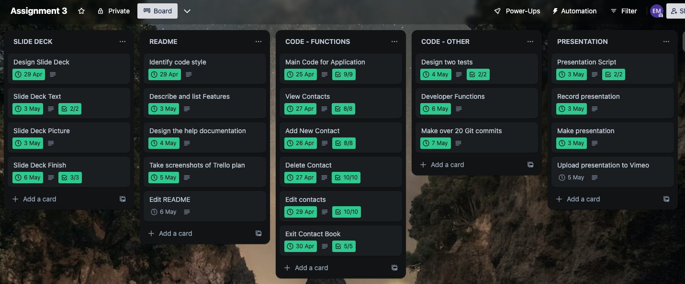

### <b>Code - Functions Plan</b>

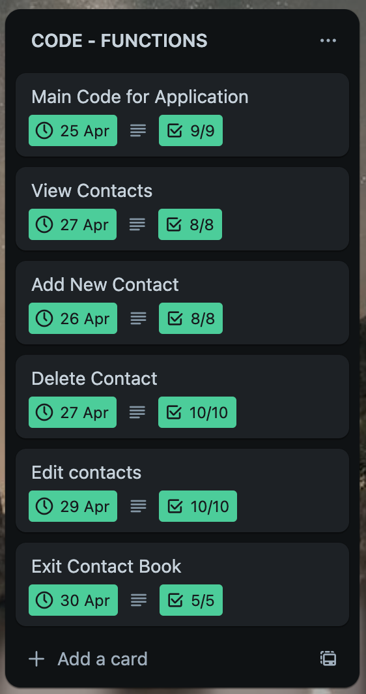

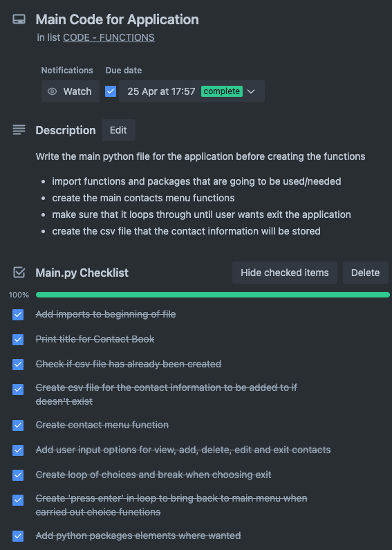

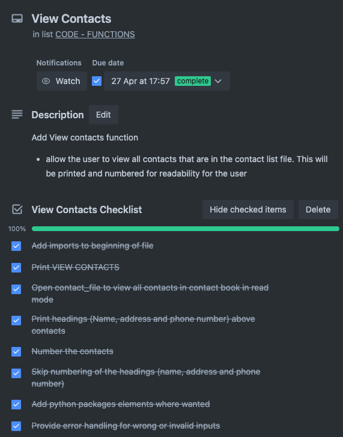

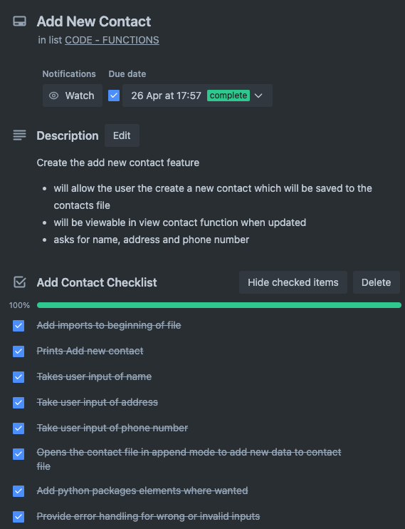

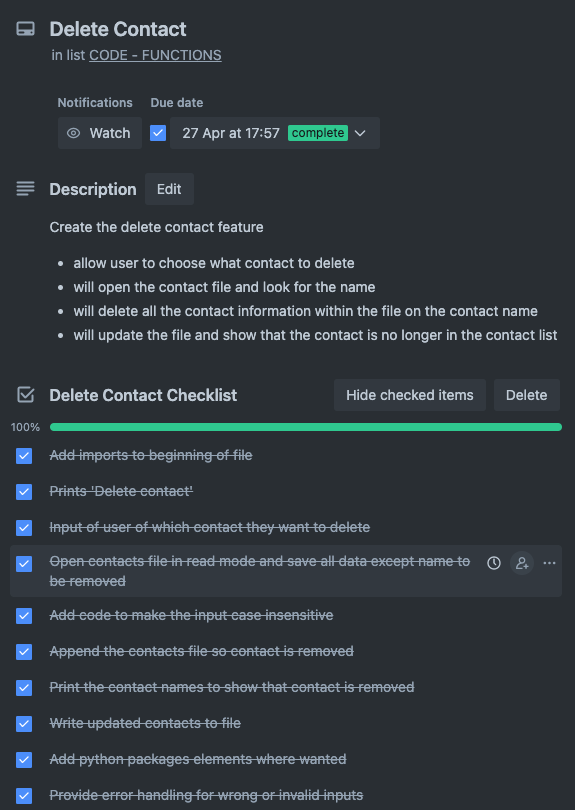

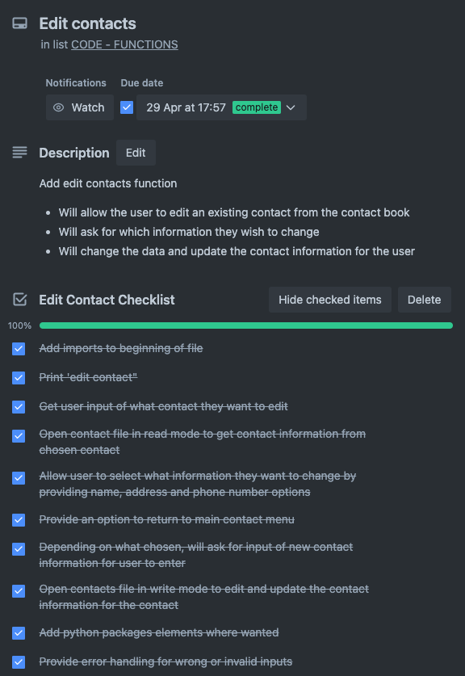

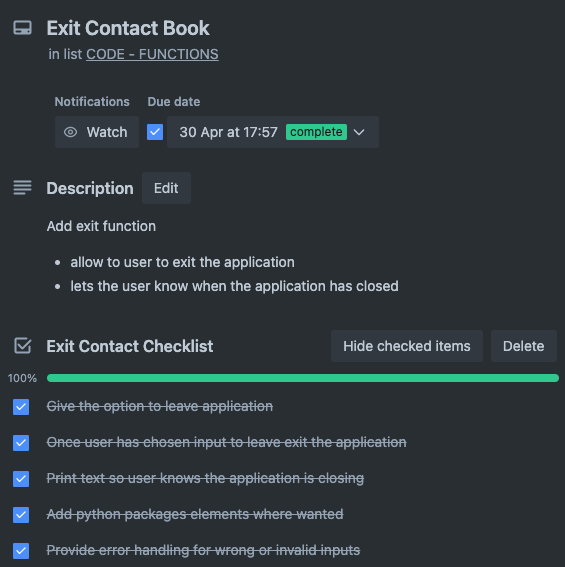

### <b>Code - Other Aspects Plan</b>

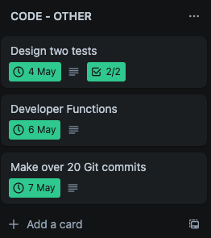

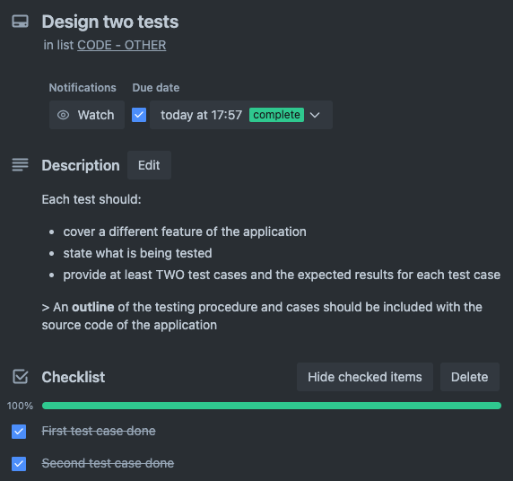

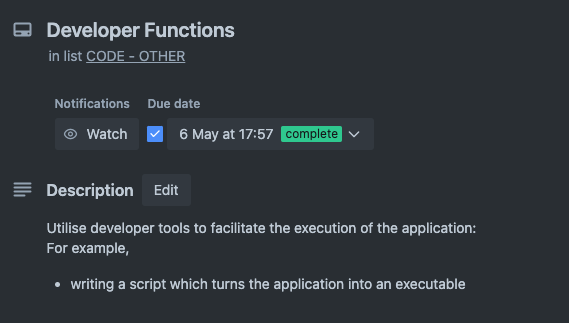

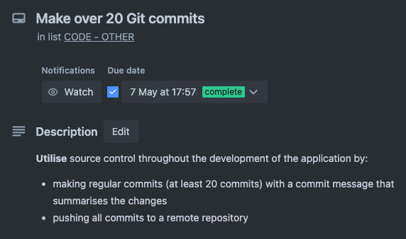


## <b><u>Help Documentation</b></u>

### <b>Steps</b>
Below is instructions which will describe how to install and use the terminal application:

- It is recommended to open from GitHub

<br>

<u>GitHub</u>

<ul><b>How to clone repository on web browser and run in VS Code</b></ul>

<br>

<b>1.</b> Go to  this GitHub link: 

<b>2.</b> Click the '<>Code' button (this is usually green)

<b>3.</b> In the local tab (shoudl be in local tab already) copy the URL of the repository. 
- This can be copied by highlighting the text and clicking left on mouse then choosing copy for the options

- On Mac 'control' + 'C' keys

- There will be three links that can be copied (HTTPS, SSH, GitHub CLI). Chose the one that you wish to copy

<b>4.</b> Open Terminal on your computer. 

- On Windows, open a terminal window by pressing the "Windows" key + "R" on your keyboard, typing "cmd", and pressing Enter. 

- On macOS or Linux, open the terminal application from the Applications menu.

<b>5.</b> Choose directory in terminal

- You change the the directory of where you want this cloned repository to be stored. Do this using the "cd" command in the terminal.

<b>6.</b> In your terminal, type "git clone", and paste the URL that you copied after it. (make sure space between)

<b>7.</b> To make clone press "Enter". (In the terminal it will show that the repository has been cloned)

<b>8.</b> Once clone is made on your computer open VS Code

- If VS Code not installed go to this link: https://code.visualstudio.com/download

- Select which VS Code to download depending on your computer

<b>9.</b> Open VS Code and go to directory where you saved the clone repository.

<b>10.</b> Once opened open a new terminal in VS Code

- In the top menu of your computer there will be a terminal tab, press it and click new terminal

<b>11.</b> Once terminal is open run this line in the terminal: scr/venv_creation.sh && src/run.sh

<b>12.</b> Press enter and this will install everything that is need to run the application. 

<b>13.</b> The applicaiton will now be running. You will be greated with the contact menu.

<br>

<ul><b>How to clone repository on web browser and run in Computer Terminal</ul></b>

<b>1.</b> Go to  this GitHub link: 

<b>2.</b> Click the '<>Code' button (this is usually green)

<b>3.</b> In the local tab (should be in local tab already) copy the URL of the repository. 
- This can be copied by highlighting the text and clicking left on mouse then choosing copy for the options

- On Mac 'control' + 'C' keys

- There will be three links that can be copied (HTTPS, SSH, GitHub CLI). Chose the one that you wish to copy

<b>4.</b> Open terminal on your computer. 

- On Windows, open a terminal window by pressing the "Windows" key + "R" on your keyboard, typing "cmd", and pressing Enter. 

- On macOS or Linux, open the terminal application from the Applications menu.

<b>5.</b> Choose directory in terminal. 

- You change the the directory of where you want this cloned repository to be stored. Do this using the "cd" command in the terminal.

<b>6.</b> In your terminal, type "git clone", and paste the URL that you copied after it. (make sure space between)

<b>7.</b> To make clone press "Enter". (In the terminal it will show that the repository has been cloned)

<b>8.</b> When repository has been cloned, navigate into the repository's directory using the "cd" command in the terminal.

<b>9.</b> Now that you are in the folder run this command to install any dependencies required for the application: scr/venv_creation.sh && src/run.sh

<b>10.</b> Press enter and this will install everything that is need to run the application. 

<b>11.</b> The applicaiton will now be running. You will be greated with the contact menu.


<br>
<br>

<u>From Folder</u>

<ul><b>If opening the application straight from the applications folder</ul></b>

<br>

<b>1.</b> Open VS Code on computer

- If VS Code not installed go to this link: https://code.visualstudio.com/download

- Select which VS Code to download depending on your computer

<b>2.</b> Once opened open a new terminal in VS Code

- In the top menu of your computer there will be a terminal tab, press it and click new terminal

<b>3.</b> Once terminal is open run this line in the terminal: scr/venv_creation.sh && src/run.sh

<b>4.</b> Press enter and this will install everything that is need to run the application. 

<b>5.</b> The applicaiton will now be running. You will be greated with the contact menu.

<br>
<br>

<u>Zip File</u>

<ul><b>If opening application from a zip folder and opening in VS Code</ul></b>

<b>1.</b> Download zip file onto computer

- Make sure to remember where you have put it

<b>2.</b> Once zip file is downloaded, extract contacts. Right-click on zip file and select "Extract All" from menu.

<b>3.</b> New window will appear asking where you want to extract the contents of the zip file. Choose a location on your computer where you want to extract the files.

<b>4.</b> Open VS Code on computer

- If VS Code not installed go to this link: https://code.visualstudio.com/download

- Select which VS Code to download depending on your computer

<b>5.</b> In VS Code, go to File > Open, and navigate to the location where you extracted the files from the zip file.

<b>6.</b> Open the file

<b>7.</b> Once opened open a new terminal in VS Code

- In the top menu of your computer there will be a terminal tab, press it and click new terminal

<b>3.</b> Once terminal is open run this line in the terminal: scr/venv_creation.sh && src/run.sh

<b>4.</b> Press enter and this will install everything that is need to run the application. 

<b>5.</b> The applicaiton will now be running. You will be greated with the contact menu.

<br>

<ul><b>If opening application from a zip folder</ul></b>

<b>1.</b> Download zip file onto computer

- Make sure to remember where you have put it

<b>2.</b> Once zip file is downloaded, extract contacts. Right-click on zip file and select "Extract All" from menu.

<b>3.</b> New window will appear asking where you want to extract the contents of the zip file. Choose a location on your computer where you want to extract the files.

<b>4.</b> Open terminal on your computer. 

- On Windows, open a terminal window by pressing the "Windows" key + "R" on your keyboard, typing "cmd", and pressing Enter. 

- On macOS or Linux, open the terminal application from the Applications menu.

<b>5.</b> Navigate to directory where you extracted the contents of the zip file

-  Use the 'cd' command

<b>6.</b> Once file is open run this line in the terminal: scr/venv_creation.sh && src/run.sh

<b>7.</b> Press enter and this will install everything that is need to run the application. 

<b>8.</b> The applicaiton will now be running. You will be greated with the contact menu.

<br>
<br>

### <u><b>System/Hardware Requirements and Dependencies</u></b>

- Python must be installed for any of the application to be run.
<ul>LINK TO INSTALL PYTHON (Choose the latest version to download): https://www.python.org/downloads/

- Follow instructions on the download</ul>

- To run the applicaiton in VS Code, the recommended computer requirements is 1.6 GHz or a faster processer of 1 GB of RAM.

- If using a older version of Python, Pip will need to be installed seperatly. This will allow the installation of packages that are used in the application. Without it the application will not run properly. 

### <u><b>How to use command line arguments</u></b>

<br>

## LINKS

GitHub:

Trello: https://trello.com/b/BAJvkRpV/assignment-3

## REFERENCES

